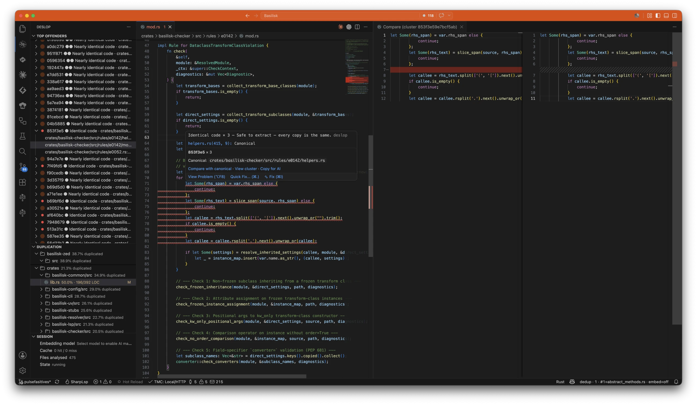

# Deslop

Live duplicate and dead code analysis inside your IDE. Inline warnings as you
type, worst-offender view, and a live channel your AI agent can consult before
it copy-pastes.

[Install for VS Code](https://marketplace.visualstudio.com/items?itemName=nimblesite.deslop-live) ·
[Add to GitHub Actions](https://deslop.live/docs/github-action/) ·
[Documentation](https://deslop.live/docs/) ·
[Releases](https://deslop.live/releases/)

[](https://deslop.live/docs/vscode-cluster-panel/)

## Install in your IDE

### VS Code

Install [Deslop Live from the VS Code Marketplace](https://marketplace.visualstudio.com/items?itemName=nimblesite.deslop-live),
then open a supported codebase. Deslop starts automatically and updates its
findings as the code changes.

You can also install a platform-specific VSIX from the
[releases page](https://deslop.live/releases/):

```bash
code --install-extension deslop-live-X.Y.Z-<target>.vsix
```

The extension bundles the LSP server, MCP server, and CLI. JetBrains support is
in development.

## Add it to your pipeline

### GitHub Actions

```yaml
- uses: actions/checkout@v4
- uses: Nimblesite/Deslop@v0.27.0
  with:
    fail-over: "5.0" # fail above 5% duplicated lines
```

The action analyses the workspace, uploads JSON, text, and HTML reports, and
fails the job if duplication exceeds the threshold. It needs no token and only
the default `contents: read` permission.

See the [GitHub Action reference](https://deslop.live/docs/github-action/) for
all inputs, outputs, supported runners, and threshold rules.

### Other CI systems

Install the CLI and run:

```bash
deslop . --fail-over 5.0
```

Exit code `3` means the duplication threshold was breached. Reports are still
written so the pipeline can expose the offenders.

```bash
# macOS / Linux
brew install nimblesite/tap/deslop

# Windows
scoop bucket add nimblesite https://github.com/Nimblesite/scoop-bucket
scoop install deslop
```

## How it works

Deslop parses code with tree-sitter and compares structure instead of merely
matching lines. That lets it find exact copies, renamed copies, and similar
implementations across a repository.

- **In the editor:** the LSP shows live findings and comparisons.
- **For coding agents:** the MCP server lets an agent call `find-similar` before
  writing a function, helper, or test setup.
- **In CI:** the CLI produces ranked reports and enforces a duplication ceiling.

All three surfaces use the same analysis engine. The worst offenders come first
so the report starts with the cleanup that matters most.

Supported languages: C#, Rust, Python, Dart, JavaScript, TypeScript, TSX, PHP,
F#, and Go.

## Connect a coding agent

The VS Code extension includes `deslop-mcp`. Point your MCP-capable agent at the
bundled binary, then add the [Deslop agent instruction](docs/snippets/agents-md-recipe.md)
to the repository so it checks for similar code before writing.

See [AI integration](https://deslop.live/docs/ai-integration/) for Claude Code,
Cursor, Copilot, Continue, Codex, and other MCP clients.

## Run a local scan

```bash
deslop                         # scan the current directory
deslop ./my-repo               # scan another repository
deslop . --output ./report     # write report.json, report.txt, report.html
```

Configuration lives in `.deslop.toml`. See the
[configuration reference](https://deslop.live/docs/configuration/) and
[configuration and reports guide](https://deslop.live/docs/configuration/#report-output).

## Project direction

Duplicate code is where Deslop starts, not where it ends. The broader goal is
to find codebase slop, prevent more from appearing, and help remove it safely.
Code removal is a direction of the project, not a shipping capability today.

See [the messaging guide](docs/messaging.md) and
[the design specification](docs/specs/SPEC.md).

## Contributing

Please do log issues — especially if you can reproduce the bug or add a lot of
detail. Those are genuinely useful.

Code contributions are discouraged at the moment. We will only consider a pull
request that:

1. directly addresses an existing, confirmed bug, and
2. comes with several end-to-end tests proving the bug is thoroughly fixed.

Anything outside that is likely to be closed unmerged, so please open an issue
first rather than writing the patch.

Requires Rust 1.80+ and GNU Make.

```bash
make build
make test
make ci
```

Read [CLAUDE.md](CLAUDE.md) before contributing.

## License

[MIT](LICENSE) © NIMBLESITE PTY LTD.
