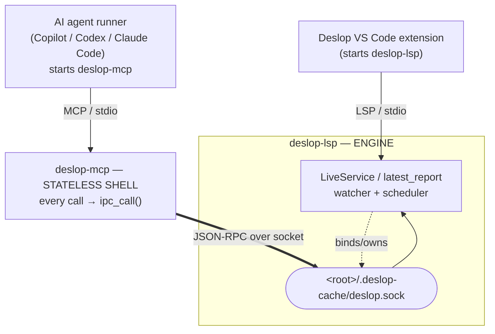

# Design: MCP self-sufficiency — LSP sidecar auto-spawn

**Status:** Proposed (design only — not implemented).
**Owner:** TBD.
**Spec IDs introduced:** `[MCP-ENGINE-BOOTSTRAP]`, `[MCP-ENGINE-BOOTSTRAP-RACE]`, `[MCP-ENGINE-BOOTSTRAP-OPTOUT]`.
**Related:** `[MCP-WHY-LIVE]`, `[MCP-IPC-CLIENT]`, `[LIVE-IPC-SOCKET]`, `[LSP-IPC]`, `[MCP-SAFETY]`; issues #141, #148, #151, #157.

## 1. Problem

A user wired the `deslop-mcp` server into GitHub Copilot's agent and **every tool call failed** — the MCP "couldn't talk to the LSP." The same MCP works flawlessly inside VS Code + Claude Code. This is not a bug in the IPC code; it is a **deployment-coupling gap**: the MCP has no way to bring up an analysis engine on its own.

## 2. Background — current wiring

`deslop-lsp` is the **engine host**: it owns the `LiveService` / `AnalysisSession` whose in-memory `latest_report` is the single source of truth, runs the file watcher + scheduler, and exposes a local IPC endpoint serving line-delimited JSON-RPC 2.0. Unix hosts bind `<root>/.deslop-cache/deslop.sock`; Windows binds token-gated TCP loopback discovered through `<root>/.deslop-cache/deslop.port` ([docs/specs/live.md §LIVE-IPC-SOCKET](../specs/live.md#live-ipc-socket)).

`deslop-mcp` is a **stateless transport shell**: `LiveBackend` holds no analysis state and has no pipeline; every tool call is one `ipc_call` to that endpoint, and "there is no fallback pipeline" ([crates/deslop-mcp/src/backend/state.rs:1-11](../../crates/deslop-mcp/src/backend/state.rs#L1-L11), [crates/deslop-mcp/src/backend/ipc.rs](../../crates/deslop-mcp/src/backend/ipc.rs)).

## 3. Root cause

The MCP **never spawns the LSP** — it only connects to a socket the LSP must already have created. So the MCP works only in a host that *also* runs the Deslop LSP. Two failure modes, both already surfaced in the `LspNotRunning` error text ([backend/mod.rs:59-65](../../crates/deslop-mcp/src/backend/mod.rs#L59-L65)):

1. **No LSP → no socket.** Copilot loads the MCP server from its MCP config but does **not** run the Deslop VS Code extension, so nothing binds `deslop.sock`. Every tool returns `-32004 lsp_not_running`. **This is the reported failure.**
2. **Root mismatch.** Even with an LSP up, an MCP launched with a different `--root` (or default `--root .` resolving to the agent's cwd) looks for the socket under the wrong `.deslop-cache/` and gets the same `-32004` (#151 / [wrong_root.rs](../../crates/deslop-mcp/tests/wrong_root.rs)).

The architecture itself is correct (`[MCP-WHY-LIVE]`: LSP is the engine, MCP is a thin live client). The missing capability is **engine bootstrap**.

## 4. Goals / non-goals

**Goals**
- The MCP works in any host (Copilot, Codex, headless, CI-adjacent) **without** requiring the VS Code extension to be running.
- Zero behavioural change when an LSP is already running for the workspace (connect to it; never double-analyse).
- No orphan processes: an MCP-spawned LSP must die with the MCP.
- No wire / version drift: an MCP-spawned LSP must be the **same bundled binary** as the MCP.

**Non-goals**
- Re-implementing analysis inside the MCP (that is the eventual `lspkit` in-process `EngineApi`, tracked separately — see §7c).
- Changing the LSP↔editor stdio protocol.

## 5. Proposed design — `[MCP-ENGINE-BOOTSTRAP]`

On startup (in `LiveBackend::initialise`, [backend/state.rs:76](../../crates/deslop-mcp/src/backend/state.rs#L76)) or lazily on the first IPC call, the MCP follows a **connect-or-spawn** handshake:

1. **Try to connect** to `<canonical_root>/.deslop-cache/deslop.sock`.
   - Success → use the existing engine (the VS Code / pre-existing LSP). **Do not spawn.**
2. **On `ConnectionRefused` / `NotFound`**, spawn a sidecar:
   - Resolve the **bundled** `deslop-lsp` by absolute path next to the running `deslop-mcp` (`std::env::current_exe()` → sibling `deslop-lsp[.exe]`). This guarantees the version-contract sibling, so #148 `-32601` drift is impossible by construction.
   - Launch `deslop-lsp --root <canonical_root>` detached, stdin/stdout to null (it is *not* an editor session — it exists only to bind the socket and analyse), stderr to the MCP's tracing sink.
   - Pass the MCP's own pid so the LSP's parent monitor watches it (see §6 lifecycle).
3. **Wait for the socket** with bounded exponential backoff (e.g. 25 ms → 800 ms, cap ~5 s total). Re-use the `retry_after_ms` value already published in the #157 recovery payload.
4. **On timeout**, fall back to the *unchanged* `-32004 lsp_not_running` error (preserving the #151 message + #157 structured `data`), so nothing regresses for hosts that opt out.

### 6. Lifecycle & ownership

The orphan-prevention primitive already exists and was just unified: `deslop_core::process::process_is_alive` ([crates/deslop-core/src/process.rs](../../crates/deslop-core/src/process.rs)), used by both the LSP parent monitor ([parent_process.rs](../../crates/deslop-lsp/src/parent_process.rs)) and the MCP parent monitor ([mcp/main.rs](../../crates/deslop-mcp/src/main.rs)).

- The sidecar LSP is launched with the **MCP's pid as its parent-to-watch**. When the MCP exits (its own parent monitor already exits it when *its* launcher dies), the sidecar LSP's monitor sees the pid vanish and `std::process::exit(0)`. No orphan.
- A sidecar LSP started by the MCP must **not** be torn down if a VS Code extension later attaches — but since both bind the *same socket path*, only one can own it; see race handling.

### 6a. Race / double-bind — `[MCP-ENGINE-BOOTSTRAP-RACE]`

Today `IpcServer::start` does `remove_file(&socket_path)` **unconditionally** before `bind` ([ipc.rs:61-64](../../crates/deslop-lsp/src/ipc.rs#L61-L64)). That is safe for a single owner but would let a second LSP **clobber a live socket**. Required change for safe auto-spawn:

- Before removing, **try to connect** to an existing socket; if a peer answers, the new LSP must exit (another engine already owns this root) rather than `remove_file` + `bind`. A stale socket (no peer) is safely removed as today.
- Two MCPs spawning concurrently: the `UnixListener::bind` loser exits on the connect-check; the winner serves both. The MCP retry-connect loop (§5.3) reconnects the loser's client to the winner.

### 6b. Opt-out — `[MCP-ENGINE-BOOTSTRAP-OPTOUT]`

A `DESLOP_MCP_NO_AUTOSPAWN=1` env var (and/or `--no-autospawn` flag) disables spawning and restores today's pure connect-or-`-32004` behaviour, for hosts that manage the LSP themselves.

## 7. Alternatives considered

- **(a) Doc-only.** Tell Copilot users to run the VS Code extension *and* pass `--root <abs path>` to the MCP. Zero code, unblocks today, but fragile and surprising — rejected as the primary fix (kept as the interim mitigation).
- **(b) In-process engine in the MCP** (the `lspkit` `EngineApi` end-state). Cleanest long-term, but the MCP would then own a watcher + scheduler, duplicating the LSP and risking two engines analysing one workspace. Defer to the toolkit migration.
- **(c) Read-only on-disk fallback.** The #157 error already advertises `cache_fallback.path = .deslop-cache/live-report.json`. The MCP could serve *read* tools from that file when no socket exists. Cheap, but compute tools (`find-similar`, `set-embedding-model`) still need a live engine, so it is a partial fix at best. Could ship alongside (a) as a stopgap.

## 8. Acceptance criteria (coarse E2E, per CLAUDE.md)

1. **Cold start**: MCP launched against a temp workspace with **no** LSP and auto-spawn on → `top-offenders` returns real clusters (the MCP spawned its own engine).
2. **Attach, don't duplicate**: an LSP already bound the socket → MCP connects; assert **no** second `deslop-lsp` process was spawned (`pgrep` count stable).
3. **No orphan**: kill the MCP → the sidecar LSP exits within ~1 monitor interval (extend [orphan_exit.rs](../../crates/deslop-mcp/tests/orphan_exit.rs)).
4. **Version safety**: the spawned LSP is the bundled sibling → no `-32601` (extend [issue_148_version_mismatch.rs](../../crates/deslop-mcp/tests/issue_148_version_mismatch.rs)).
5. **Opt-out preserved**: `DESLOP_MCP_NO_AUTOSPAWN=1` → unchanged `-32004` with the #151 message + #157 `data` intact ([issue_157](../../crates/deslop-mcp/tests/issue_157_lsp_not_running_recovery_data.rs) must still pass verbatim).

## 9. Open questions

- Should the sidecar LSP seed from the warm-start cache ([LIVE-SEED-CACHE]) for a faster first report, or always cold-scan?
- Backoff ceiling vs. large-repo first-scan latency — may need a "spawned, analysing" interim response rather than a hard timeout.
- Windows: `current_exe()` sibling resolution + detached-process flags need a Windows-specific path (the `tasklist` branch in `process_is_alive` is already cross-platform).
