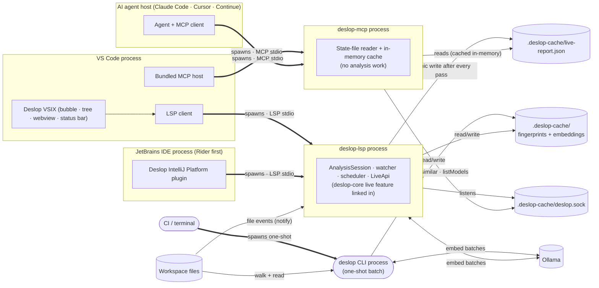

# Deslop — Research & Spec

This doc indexes the formal research and design spec for Deslop. **Primary goal:** build a **live duplicate-code analysis server** (LSP + MCP) that stays fast enough to sit in an AI coding agent's inner loop and an editor's keystroke loop — incremental, per-file, byte-range-addressable, cheap to keep live under a file watcher, and accurate across the four clone buckets in [CLONE-BUCKETS] (canonical human-facing labels; academic Type-1 → Type-4 mapping preserved in the same table). The CLI is a secondary surface — same engine, run once, emit a report — used for CI gates and cold-cache audits. Every design decision is judged against whether it still works when the pipeline runs a thousand times per minute, not once per PR.

## Live = Reactive

**This is the load-bearing invariant of the entire product.** *Live* means *reactive*: the moment a change to a watched file produces a new pipeline output, every reader of that output — every editor surface, every webview, every agent — observes the new state **immediately**. Not on the next save. Not when the editor refreshes. Not on a polling timer. Not after a manual command. **Immediately**, in the same microtask that the LSP fires `deslop/reportChanged`. A cluster removed from the source cannot remain visible in the tree, in the bubble, in a hover, in a code lens, in the status bar, in an MCP response, or in any future surface. The CLI is the **only** non-reactive surface in the product — it is the cold-cache fallback for CI gates and one-shot audits, and it exists because reactivity has no meaning for a process that exits before its caller reads the result. Every other surface is reactive by construction; "stale UI" is not a polish defect, it is a correctness bug that fails the brand promise. See [principles.md §[PRINCIPLES-LIVE-IS-REACTIVE]](principles.md#principles-live-is-reactive) for the enforcing rule, [live.md §[LIVE-NOTIFICATIONS]](live.md#live-notifications) for the wire contract, and [vsix.md §[VSIX-REACTIVITY-INVARIANT]](vsix.md#vsix-reactivity-invariant) for the editor-side acceptance test.

The spec is split into topic files for readability and the 500-line file budget. Hierarchical `[GROUP-TOPIC-DETAIL]` IDs (e.g. `[PIPELINE-RANK-WORST-FIRST]`) are stable across the split — `grep -r '\[PIPELINE-' docs/` still finds every reference.

## Canonical clone buckets

Every user-facing surface (HTML report, CLI summary, VS Code extension) labels clusters with the four buckets defined in **[taxonomy.md §[CLONE-BUCKETS]](taxonomy.md)** — `Identical`, `NearlyIdentical`, `LooselySimilar`, `SameBehavior`. That table is the single source of truth. The dual-labelling policy in [CLONE-BUCKETS-DUAL-LABEL] explains when the academic `Type-1 → Type-4` labels appear (JSON + agent-facing surfaces) and when they must not (human UI).

## Architecture at a glance

Every binary is a **thin shell over one shared library** (`deslop-core`). Live analysis is a feature-gated `live` module inside that crate, owned exclusively by `deslop-lsp`. `deslop-mcp` runs no analysis — it reads the state file the LSP writes after every pass. A language is added once, in the core, and every shell inherits it. See [live.md §[LIVE-PACKAGING]](live.md) for the full flow chart.

Every shippable executable and editor package is governed by the Deployment Toolkit manifest contract in [deployment.md](deployment.md).

The hot loop — **Developer → VSIX → LSP → `live` module → `update_files` → pipeline** — is one process hop. The agent path — **Agent → MCP → state file** — is zero analysis work: the MCP serves the latest report the LSP already produced. The CI path — **CI → CLI → pipeline** — skips `live` entirely.

## Topic files

- [principles.md](principles.md) — `[PRINCIPLES-*]` audience-for-AI-agents, long-running-daemon constraints.
- [taxonomy.md](taxonomy.md) — `[CLONE-BUCKETS]` canonical human-facing buckets (`Identical` / `NearlyIdentical` / `LooselySimilar` / `SameBehavior`), dual-labelling policy, signal routing, and academic `[CLONE-TYPE-TAXONOMY]` reference (Type-1 / Type-2 / Type-3 / Type-4).
- [landscape.md](landscape.md) — `[TECH-*]` survey of token / AST / hashing / neural / LLM techniques (2009 → 2026).
- [fusion.md](fusion.md) — `[FUSION-*]` why Deslop is hybrid (not pure-RAG); embedding + ANN choices; max-sum fusion strategy.
- [pipeline.md](pipeline.md) — `[PIPELINE-*]`, `[STATE-*]`, `[OUTPUT-*]`, `[METRICS-*]`, `[EXIT-CODES]` per-stage design: language plugin trait, discovery, normalization, Merkle fingerprint, clustering, ranking, `[PIPELINE-INCREMENTAL]` on-disk fingerprint cache, JSON / text / HTML output, human-readable HTML mode, repo-wide duplication metric + fail-over threshold.
- [exclusion.md](exclusion.md) — `[EXCLUSION-CONFIG]` `.deslop.toml` `exclude` / `report_hide` tiers and per-language overlays; `[CONFIG-CROSS-LANGUAGE]` candidate-pair language scope.
- [decisions.md](decisions.md) — `[DECISION-*]` defaults with fallback rules (`--min-nodes`, cross-language, two-pass Type-3 recall).
- [reading-list.md](reading-list.md) — `[READ-LIST-DEDUPED]` deduplicated bibliography.
- [live.md](live.md) — `[LIVE-*]` in-process analysis session inside the LSP: lifecycle, watcher, scheduler, state file, IPC socket, delta protocol, `LiveApi` query surface, push notifications.
- [lsp.md](lsp.md) — `[LSP-*]` Language Server Protocol shell: capabilities, diagnostics, code lens, hover, virtual docs, custom methods.
- [mcp.md](mcp.md) — `[MCP-*]` Model Context Protocol shell: tools, resources, notifications. `find-similar` is the keystone tool for AI agents.
- [deployment.md](deployment.md) — `[DEPLOY-*]` Deployment Toolkit manifest, executable version contract, editor-host binary resolvers, VSIX / JetBrains package contents, and release gates.
- [vsix.md](vsix.md) — `[VSIX-*]` VS Code extension: tree view, decorations, webviews, embedding-model picker (Ollama integration), status bar, settings.
- [jetbrains.md](jetbrains.md) — `[JETBRAINS-*]` IntelliJ Platform plugin: Rider-first LSP client, binary resolution, native IDE surfaces, packaging, and testing.
- [competitors.md](competitors.md) — `[COMPETE-*]` landscape of clone-detection tooling (CPD, Simian, jscpd, Sonar CPD, NiCad, ConQAT, SourcererCC) and where Deslop beats them.
- [autofix-extract.md](autofix-extract.md) — `[AUTOFIX-EXTRACT-*]` LSP `refactor.extract` code action that rewrites true Type-1 clusters as a single shared method. v1: pure tree-sitter, no semantic model, blocked on the bucket Type-1 / Type-2 split.

## Algorithm implementation status

The pipeline draws on a small handful of clone-detection research lines. Every algorithm called out in [landscape.md](landscape.md) and [fusion.md](fusion.md) is mapped here to the file that implements it (✅) or to the plan file that tracks it (⏳). Status markers are mechanical; they reflect what `cargo build` and `make ci` produce today, not aspirations.

| Research line | Status | Implementation pointer |
| --- | --- | --- |
| Tree-sitter parsing per language ([PIPELINE-LANG-TRAIT]) | ✅ C# / Rust / Python | [`crates/deslop-core/src/lang/`](../../crates/deslop-core/src/lang/) — `csharp.rs`, `rust_lang.rs`, `python.rs`, `shared.rs` |
| Baxter-style AST normalization ([PIPELINE-NORMALIZE-AST]) | ✅ | `crates/deslop-core/src/lang/shared.rs::build_normalised_root` |
| Boilerplate-only filter ([PIPELINE-BOILERPLATE-FILTER]) | ✅ | `crates/deslop-core/src/boilerplate.rs` (called from `fingerprint.rs` + `sibling.rs`) |
| Chilowicz Merkle subtree fingerprints ([PIPELINE-FINGERPRINT-MERKLE]) | ✅ BLAKE3 | `crates/deslop-core/src/fingerprint.rs::collect_non_boilerplate_fingerprints` |
| Sibling-window extension (Type-3 recall) | ✅ widths 2–8 | `crates/deslop-core/src/sibling.rs::collect_non_boilerplate_sibling_fingerprints` |
| Exact-clone clustering ([PIPELINE-CLUSTER-EXACT]) | ✅ | `crates/deslop-core/src/pair.rs::collect_structural_pairs` |
| SourcererCC token k-grams + Jaccard | ✅ | `crates/deslop-core/src/tokens.rs` |
| MinHash signatures (Broder 1997) | ✅ 128 hashes | `crates/deslop-core/src/lsh.rs::minhash_signature` |
| LSH banding (Indyk & Motwani) | ✅ 32 bands × 4 rows | `crates/deslop-core/src/lsh.rs::band_collisions` |
| Embedding pass — local-by-default | ✅ Ollama provider | `crates/deslop-core/src/embedding/ollama.rs`, `crates/deslop-core/src/embedding/provider.rs` |
| HNSW ANN index ([FUSION-EMBED-PROVIDER]) | ✅ `instant-distance` | `crates/deslop-core/src/embedding/pairs.rs` |
| Embedding cache keyed by `(content, provider, model, version)` | ✅ | `crates/deslop-core/src/embedding/cache.rs` |
| Max/sum fusion (ensemble-LLM 2025) ([FUSION-STRATEGY-MAX-SUM]) | ✅ clamped to `[0,1]` | `crates/deslop-core/src/pair.rs::PairScore::fused` |
| Cross-language opt-in ([CONFIG-CROSS-LANGUAGE]) | ✅ | `crates/deslop-core/src/pair.rs::candidate_pairs_for_language_policy` |
| Transitive-closure clustering | ✅ | `crates/deslop-core/src/cluster.rs` |
| Worst-offenders ranking ([PIPELINE-RANK-WORST-FIRST]) | ✅ `nodes × (size−1) × log2(1 + spanned_bytes)` | `crates/deslop-core/src/cluster.rs::rank_weight` |
| Repo-wide metrics + fail-over threshold ([METRICS-REPO], [EXIT-CODES]) | ✅ exit 3 on breach | `crates/deslop-core/src/report_metrics.rs`, `crates/deslop/src/main.rs` |
| Incremental fingerprint cache ([PIPELINE-INCREMENTAL]) | ✅ opt-in `--incremental` | `crates/deslop-core/src/fpcache.rs` |
| JSON / text / human-HTML renderers ([OUTPUT-SCHEMA-JSON], [OUTPUT-HUMAN-HTML]) | ✅ | `crates/deslop-core/src/render/`, `crates/deslop-core/src/report_render.rs` |
| Live `AnalysisSession` + watcher + scheduler ([LIVE-*]) | ✅ debounce 250 ms / cap 2 s | `crates/deslop-core/src/live/` (`session.rs`, `watcher.rs`, `scheduler.rs`, `debouncer.rs`) |
| LSP server with diagnostics, hover, code lens, custom `deslop/*` methods ([LSP-*]) | ✅ | `crates/deslop-lsp/src/` |
| MCP server with `find-similar`, `top-offenders`, `cluster-by-id`, etc. ([MCP-*]) | ✅ state-file + IPC | `crates/deslop-mcp/src/` |
| State-file + IPC architecture | ✅ `.deslop-cache/live-report.json` + `.deslop-cache/deslop.sock` | `crates/deslop-lsp/tests/state_file_and_ipc.rs`, `crates/deslop-mcp/tests/lsp_integration.rs` |
| Canonical clone buckets ([CLONE-BUCKETS]) | ✅ `Identical` / `NearlyIdentical` / `LooselySimilar` / `SameBehavior` | `crates/deslop-core/src/buckets.rs` |
| Deployment Toolkit manifest ([DEPLOY-*]) | ✅ | `shipwright.json`, `scripts/verify-*` |
| VS Code extension ([VSIX-*]) | ✅ v0.1, signal-driven reactivity | `clients/vscode/` (preact-signals wired through `ReportStore`) |
| JetBrains plugin ([JETBRAINS-*]) | ⏳ scaffold + LSP support; native UX in [`plans/jetbrains-ux-plan.md`](../plans/jetbrains-ux-plan.md) | `clients/jetbrains/` |
| Type-1 / Type-2 bucket split (autofix prerequisite) | ⏳ tracked by [#42](https://github.com/Nimblesite/Deslop/issues/42) | — |
| Autofix `refactor.extract` for Type-1 ([AUTOFIX-EXTRACT-*]) | ⏳ | [`plans/autofix-extract-method-plan.md`](../plans/autofix-extract-method-plan.md) |
| Autofix AI-assisted Extract for Type-2 / Type-3 | ⏳ | [`plans/autofix-extract-ai-plan.md`](../plans/autofix-extract-ai-plan.md) |
| Rator-style node degrees-of-freedom encoding ([TECH-LLM-HYBRID]) | 🚫 not implemented | research only — would replace LSH if adopted |
| HyClone-style execution-validated Type-4 ([TECH-LLM-HYBRID]) | 🚫 not implemented | research only — Python-specific |
| LLM-ensemble embedding fusion (multi-model max/sum) | 🚫 not implemented | single embedding model today; provider trait keeps this open |
| Winnowing / SimHash primitives | 🚫 not used | MinHash chosen per [In Defense of MinHash Over SimHash](http://proceedings.mlr.press/v33/shrivastava14.pdf) |

Site-facing version of the same map: [`site/src/docs/research-background.md`](../../site/src/docs/research-background.md).

## Sibling docs

- [REPORTING-CONTEXT.md](REPORTING-CONTEXT.md) — embedded `schema_doc` agents see at the top of every JSON report.
- [../plans/PLAN.md](../plans/PLAN.md) — execution plan + live TODO.
