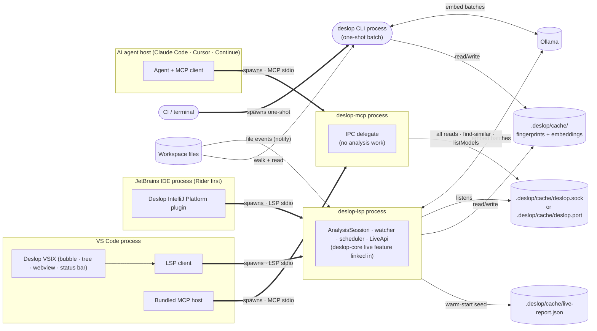

# Deslop — Research & Spec

This document indexes Deslop's research and design specs. The primary product is an incremental, byte-range-addressable duplicate-code server for editors and AI agents; the same engine powers the one-shot CLI used by CI and cold-cache audits. Explicit pair classification follows [CLONE-BUCKETS]; clusters contain membership and mass.

**Live = Reactive.** Every long-running surface applies each `deslop/reportChanged` generation in the same microtask; removed clusters must disappear from every reader. The CLI is the sole non-reactive surface. See [PRINCIPLES-LIVE-IS-REACTIVE](principles.md#principles-live-is-reactive), [LIVE-NOTIFICATIONS](live.md#live-notifications), and [VSIX-REACTIVITY-INVARIANT](vsix.md#vsix-reactivity-invariant).

The spec is split into topic files for readability and the 500-line file budget. Hierarchical `[GROUP-TOPIC-DETAIL]` IDs (e.g. `[PIPELINE-RANK-WORST-FIRST]`) are stable across the split — `grep -r '\[PIPELINE-' docs/` still finds every reference.

**Pair evidence and cluster mass are separate.** [taxonomy.md §CLONE-BUCKETS](taxonomy.md#clone-buckets) classifies one explicit pair. No pair label or score appears on a cluster. Cluster surfaces render occurrence membership and [RANK-MASS-SUM] only.

**Architecture at a glance.** Every binary is a **thin shell over one shared library** (`deslop-core`). Live analysis is a feature-gated `live` module inside that crate, owned exclusively by `deslop-lsp`. `deslop-mcp` runs no analysis — it delegates reads and compute calls to the running LSP over the local IPC endpoint. A language is added once, in the core, and every shell inherits it. See [live.md §[LIVE-PACKAGING]](live.md) for the full flow chart.

Every shippable executable and editor package is governed by the Deployment Toolkit manifest contract in [deployment.md](deployment.md).

The hot loop — **Developer → VSIX → LSP → `live` module → `update_files` → pipeline** — is one process hop. The agent path — **Agent → MCP → LSP IPC** — is zero analysis work: the MCP serves the latest report the LSP already produced. The CI path — **CI → CLI → pipeline** — skips `live` entirely.

## [SPEC-TOPIC-FILES] Topic files

- [principles.md](principles.md) — `[PRINCIPLES-*]` audience-for-AI-agents, long-running-daemon constraints.
- [taxonomy.md](taxonomy.md) — `[CLONE-BUCKETS]` explicit-pair classifications, pair-only labelling, evidence routing, the `[CLONE-BUCKETS-IDENTICAL]` byte-equivalence proof, and academic `[CLONE-TYPE-TAXONOMY]` reference.
- [noise.md](noise.md) — `[CLONE-NOISE-*]` false-positive suppression filters: shape-identical-but-not-extractable patterns (language scaffolding, framework mirrors, schema/data tables, test idioms) hidden after clustering and before ranking, each with a verbatim escape hatch.
- [landscape.md](landscape.md) — `[TECH-*]` survey of token / AST / hashing / neural / LLM techniques (2009 → 2026).
- [fused.md](fused.md) — `[FUSED-*]` pair-only structural, token, embedding, and content evidence; pair admission and shared-subtree rescue; transitive closure; pure-mass cluster ranking; complete algebra; and `[FUSED-TUNING-LEVERS]`.
- [pipeline.md](pipeline.md) — `[PIPELINE-*]`, `[STATE-*]`, `[OUTPUT-*]`, `[METRICS-*]`, `[EXIT-CODES]` per-stage design: language plugin trait, discovery, normalization, Merkle fingerprint, clustering, ranking, `[PIPELINE-INCREMENTAL]` persisted parse processing (content-addressed on-disk store), `[PIPELINE-INCREMENTAL-INTEGRITY]` blob binding digest and bounded decode, `[PIPELINE-INCREMENTAL-RETENTION]` store pruning and size budget, `[PIPELINE-INCREMENTAL-ANALYSIS]` reuse contract for incremental passes, `[PIPELINE-DETERMINISM]` cross-run reproducibility, JSON / text / HTML output, human-readable HTML mode, repo-wide duplication metric + fail-over threshold.
- [cli.md](cli.md) — `[CLI-*]`, `[UX-*]`, `[OUTPUT-FORMAT-DERIVED]` the one-shot `deslop` binary: invocation contract (path / help / version / `--embeddings`), derived output formats, and terminal UX (preamble, plain vs `--technical` summary, colour and logging controls).
- [exclusion.md](exclusion.md) — `[EXCLUSION-CONFIG]` `.deslop.toml` `exclude` / `report_hide` tiers and per-language overlays; `[CONFIG-EXCLUDE-BUILTIN]` built-in dependency/artefact component lists and their scan-root scope; `[CONFIG-EXCLUDE-DEPENDENCIES]` the `include_dependencies` opt-in; `[CONFIG-CROSS-LANGUAGE]` candidate-pair language scope; `[CONFIG-INCREMENTAL-OPTOUT]` the `[analysis] incremental` escape hatch for persisted processing; the `[tuning]` accuracy-lever surface with `[CONFIG-TUNING-CACHE]` cache-keyed representation parameters and `[CONFIG-TUNING-DECLARED]` the report's tuning declaration.
- [decisions.md](decisions.md) — `[DECISION-*]` defaults with fallback rules (`--min-nodes`, cross-language, two-pass Type-3 recall).
- [reading-list.md](reading-list.md) — deduplicated bibliography.
- [live.md](live.md) — `[LIVE-*]` in-process analysis session inside the LSP: lifecycle, watcher, scheduler, state file, IPC socket, delta protocol, `LiveApi` query surface, push notifications.
- [lsp.md](lsp.md) — `[LSP-*]` Language Server Protocol shell: capabilities, diagnostics, code lens, hover, virtual docs, custom methods.
- [severity.md](severity.md) — `[SEVERITY-*]` the mass-rank severity model, diagnostics-off-by-default gate, and engine-stamped rank-band projection consumed by lsp.md and vsix.md.
- [mcp.md](mcp.md) — `[MCP-*]` Model Context Protocol shell: tools, resources, notifications. `find-similar` is the keystone tool for AI agents.
- [deployment.md](deployment.md) — `[DEPLOY-*]` Deployment Toolkit manifest, executable version contract, editor-host binary resolvers, VSIX / JetBrains package contents, and release gates.
- [vsix.md](vsix.md) — `[VSIX-*]` VS Code extension: tree view, decorations, embedding-model picker (Ollama integration), status bar, settings, and the cross-surface state/reactivity invariants.
- [webview-runtime.md](webview-runtime.md) — `[VSIX-WEBVIEW-*]` / `[VSIX-REACTIVITY-WEBVIEW]` / `[VSIX-METRICS-REPORT]` the VSIX Preact webview runtime: cluster / report / duplication webviews, the signal store, the host↔webview message protocol (`[VSIX-WEBVIEW-PROTOCOL]`), cluster link documents, and the `[VSIX-WEBVIEW-COVERAGE]` coverage gate.
- [jetbrains.md](jetbrains.md) — `[JETBRAINS-*]` IntelliJ Platform plugin: Rider-first LSP client, binary resolution, native IDE surfaces, packaging, and testing.
- [corpus.md](corpus.md) — `[CORPUS-*]` the real-repository accuracy and resource gate: pinned clones, curated duplicates, ranking rules, resource ceilings, and the known-failures ratchet that keeps tracked defects visible without blocking merges.
- [comparison.md](comparison.md) — landscape of clone-detection tooling (CPD, Simian, jscpd, Sonar CPD, NiCad, ConQAT, SourcererCC) and where Deslop beats them.
- [autofix-extract.md](autofix-extract.md) — `[AUTOFIX-*]` the mechanical (zero-risk, no-AI) deduplication family: `[AUTOFIX-EXTRACT]` Type-1 verbatim extract, `[AUTOFIX-MERGE]` leaf-gap Type-2/3 call-site merge via anti-unification with default-valued parameters, `[AUTOFIX-CONSOLIDATE]` cross-file identical-definition consolidation, the `[AUTOFIX-CATALOG]` of further fixes, and the `[AUTOFIX-EXTRACT-AI]` fallback. Safety is underwritten by the static type checker (`[AUTOFIX-ZERO-RISK]`; Dart/C#/Rust first, Python under strict typing).

**Implementation map.** The pipeline draws on a small handful of clone-detection research lines. Every algorithm called out in [landscape.md](landscape.md) and [fused.md](fused.md) is mapped here to the file that implements it (✅) or to the plan file that tracks it (⏳). Status markers are mechanical; they reflect what `cargo build` and `make ci` produce today, not aspirations.

| Research line | Status | Implementation pointer |
| --- | --- | --- |
| Tree-sitter parsing per language ([PIPELINE-LANG-TRAIT]) | ✅ C# / Rust / Python / Dart / JavaScript / TypeScript / TSX / PHP / F# / Go | [`crates/deslop-core/src/lang/`](../../crates/deslop-core/src/lang/) — `csharp.rs`, `rust_lang.rs`, `python.rs`, `dart.rs`, `javascript.rs`, `typescript.rs`, `ecmascript.rs`, `php.rs`, `fsharp.rs`, `go.rs`, `shared.rs` |
| Baxter-style AST normalization ([PIPELINE-NORMALIZE-AST]) | ✅ | `crates/deslop-core/src/lang/shared.rs::build_normalised_root` |
| Boilerplate-only filter ([PIPELINE-BOILERPLATE-FILTER]) | ✅ | `crates/deslop-core/src/boilerplate.rs` (called from `fingerprint.rs` + `sibling.rs`) |
| Chilowicz Merkle subtree fingerprints ([PIPELINE-FINGERPRINT-MERKLE]) | ✅ BLAKE3 | `crates/deslop-core/src/fingerprint.rs::collect_non_boilerplate_fingerprints` |
| Sibling-window extension (Type-3 recall) | ✅ widths 2–8 | `crates/deslop-core/src/sibling.rs::collect_non_boilerplate_sibling_fingerprints` |
| Exact-clone clustering ([PIPELINE-CLUSTER-EXACT]) | ✅ | `crates/deslop-core/src/pair.rs::collect_structural_pairs` |
| SourcererCC token k-grams + Jaccard | ✅ | `crates/deslop-core/src/tokens.rs` |
| MinHash signatures (Broder 1997) | ✅ 128 hashes | `crates/deslop-core/src/lsh.rs::minhash_signature` |
| LSH banding (Indyk & Motwani) | ✅ 32 bands × 4 rows | `crates/deslop-core/src/lsh.rs::band_collisions` |
| Embedding pass — local-by-default | ✅ Ollama provider | `crates/deslop-core/src/embedding/ollama.rs`, `crates/deslop-core/src/embedding/provider.rs` |
| HNSW ANN index ([FUSED-EMBED-PROVIDER]) | ✅ `instant-distance` | `crates/deslop-core/src/embedding/pairs.rs` |
| Embedding cache keyed by `(content, provider, model, version)` | ✅ | `crates/deslop-core/src/embedding/cache.rs` |
| Pair admission ([FUSED-STRATEGY-BOUNDED-MAX]) | ✅ `max(S,J,E)` plus applicable pair-content support; all values pair-only | `crates/deslop-core/src/pair.rs` |
| Cross-language opt-in ([CONFIG-CROSS-LANGUAGE]) | ✅ | `crates/deslop-core/src/pair.rs::candidate_pairs_for_language_policy` |
| Accuracy levers as configuration ([FUSED-TUNING-LEVERS]) | ⏳ compiled `const` today; migration in [`plans/unhardcode-tuning-plan.md`](../plans/unhardcode-tuning-plan.md) | `pair.rs`, `buckets.rs`, `content.rs`, `cluster.rs`, `embedding/pairs.rs`, `report.rs` |
| Built-in exclusion scoped to the scan root ([CONFIG-EXCLUDE-BUILTIN]) | ✅ gh #342 | `crates/deslop-core/src/config.rs::corpus_built_in_excluded` |
| Dependency analysis opt-in ([CONFIG-EXCLUDE-DEPENDENCIES]) | ✅ `[analysis] include_dependencies` | `crates/deslop-core/src/config.rs::dependency_components` |
| Transitive-closure clustering | ✅ | `crates/deslop-core/src/cluster.rs` |
| Worst-offenders ranking ([RANK-MASS-SUM]) | ✅ `canonical_nodes × max(visible_members − 1, 0)`, then mass descending and cluster id ascending; no other term | `crates/deslop-core/src/report_weight.rs::reweigh_by_visible_occurrences` |
| Repo-wide metrics + fail-over threshold ([METRICS-REPO], [EXIT-CODES]) | ✅ exit 3 on breach | `crates/deslop-core/src/report_metrics.rs`, `crates/deslop/src/main.rs` |
| Evidence-weighted cluster metric | ❌ prohibited: pair evidence cannot weight a cluster; repo duplication is mechanical duplicated mass | — |
| Persisted parse processing ([PIPELINE-INCREMENTAL]) | ✅ on by default, `--no-incremental` / `[analysis] incremental = false` opt out — parse stage plus per-fingerprint MinHash signatures, blobs bound to their address by a binding digest ([PIPELINE-INCREMENTAL-INTEGRITY]), pruned under a 2 GiB budget after every full pass ([PIPELINE-INCREMENTAL-RETENTION]) | `crates/deslop-core/src/fpcache.rs` |
| Incremental analysis ([PIPELINE-INCREMENTAL-ANALYSIS]) | ⏳ signature reuse ✅ (persisted beside fingerprints, validated on hit, pinned by `signature_reuse.rs`); warm/cold equivalence ✅ on both reuse paths (`incremental_equivalence.rs` across processes, `live_session_equivalence.rs` inside one session); remaining downstream stages per gh #383 | `crates/deslop-core/src/pipeline/corpus.rs`, `crates/deslop-core/src/pipeline/signatures.rs` |
| JSON / text / human-HTML renderers ([OUTPUT-SCHEMA-JSON], [OUTPUT-HUMAN-HTML]) | ✅ | `crates/deslop-core/src/render/`, `crates/deslop-core/src/report_render.rs` |
| Live `AnalysisSession` + watcher + scheduler ([LIVE-*]) | ✅ debounce 250 ms / cap 2 s | `crates/deslop-core/src/live/` (`session.rs`, `watcher.rs`, `scheduler.rs`, `debouncer.rs`) |
| LSP server with diagnostics, hover, code lens, custom `deslop/*` methods ([LSP-*]) | ✅ | `crates/deslop-lsp/src/` |
| MCP server with seven core analysis tools: `find-similar`, `duplicates`, `compare-pair`, `cluster-by-id`, `rescan`, `session`, and `schema-doc` ([MCP-*]) | ⏳ wholesale cutover in [`plans/literal-constant-plan.md`](../plans/literal-constant-plan.md) | `crates/deslop-mcp/src/` |
| State-file + IPC architecture | ✅ warm-start `live-report.json`, Unix socket, token-gated TCP | `crates/deslop-lsp/tests/state_file_and_ipc.rs`, `crates/deslop-mcp/tests/lsp_integration.rs`, `crates/deslop-mcp/tests/tcp_transport.rs` |
| Explicit pair classifications ([CLONE-BUCKETS]) | ✅ pair-only `Identical` / `NearlyIdentical` / `StructuralOnly` / `LooselySimilar` / `SameBehavior`; forbidden on clusters | `crates/deslop-core/src/buckets.rs` |
| Deployment Toolkit manifest ([DEPLOY-*]) | ✅ | `shipwright.json`, `scripts/deployment/verify-*` |
| VS Code extension ([VSIX-*]) | ✅ v0.1, signal-driven reactivity | `clients/vscode/` (preact-signals wired through `ReportStore`) |
| JetBrains plugin ([JETBRAINS-*]) | ⏳ scaffold + LSP support; native UX in [`plans/jetbrains-ux-plan.md`](../plans/jetbrains-ux-plan.md) | `clients/jetbrains/` |
| Type-1 pair proof (autofix prerequisite) | ✅ byte-equivalence routing ([CLONE-BUCKETS-IDENTICAL]), shipped via [#42](https://github.com/Nimblesite/Deslop/issues/42) / PR #63 | `crates/deslop-core/src/buckets.rs` |
| Autofix `refactor.extract` for Type-1 ([AUTOFIX-EXTRACT]) | ✅ C# / Rust / Python | `crates/deslop-core/src/refactor/` |
| Mechanical call-site merge — anti-unification + default params ([AUTOFIX-MERGE]) | ✅ C# / Rust / Dart; Python refuses pending strict-typing detection | `crates/deslop-core/src/refactor/merge/` |
| Cross-file identical-definition consolidation ([AUTOFIX-CONSOLIDATE]) | ✅ v1.1 Rust sibling modules incl. definition runs + binding-drift gate; conservative limits tracked in [#281](https://github.com/Nimblesite/Deslop/issues/281) | `crates/deslop-core/src/refactor/consolidate/` |
| Autofix AI-assisted Extract — fallback after [AUTOFIX-MERGE] | ⏳ | [`plans/autofix-extract-ai-plan.md`](../plans/autofix-extract-ai-plan.md) |
| Rator-style node degrees-of-freedom encoding | 🚫 not implemented | research only — would replace LSH if adopted; background in [landscape.md](landscape.md#tech-llm-hybrid) |
| HyClone-style execution-validated Type-4 | 🚫 not implemented | research only — Python-specific; background in [landscape.md](landscape.md#tech-llm-hybrid) |
| LLM-ensemble embedding combination (multi-model max/sum) | 🚫 not implemented | single embedding model today; provider trait keeps this open |
| Winnowing / SimHash primitives | 🚫 not used | MinHash chosen per [In Defense of MinHash Over SimHash](http://proceedings.mlr.press/v33/shrivastava14.pdf) |

Site-facing version of the same map: [`site/src/docs/research-background.md`](../../site/src/docs/research-background.md).

## [SPEC-SIBLING-DOCS] Sibling docs

- [REPORTING-CONTEXT.md](REPORTING-CONTEXT.md) — the `schema_doc` markdown agents fetch on demand (`schema-doc` tool / `deslop://schema` resource); rendered CLI reports carry the field present-but-empty (#110/#111, [OUTPUT-SCHEMA-JSON]).
- [../plans/](../plans/) — remaining work, one file per work stream.
