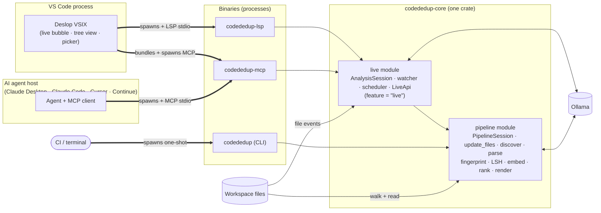

# Deslop — Research & Spec

This doc indexes the formal research and design spec for Deslop. **Primary goal:** pick techniques that are (a) fast enough for a CLI to run on a whole repo, (b) accurate across the four clone buckets in [CLONE-BUCKETS] (canonical human-facing labels; academic Type-1 → Type-4 mapping preserved in the same table), and (c) compatible with a future **long-running MCP/LSP** mode — incremental, per-file, byte-range-addressable, and cheap to keep live under a file watcher.

The spec is split into topic files for readability and the 500-line file budget. Hierarchical `[GROUP-TOPIC-DETAIL]` IDs (e.g. `[PIPELINE-RANK-WORST-FIRST]`) are stable across the split — `grep -r '\[PIPELINE-' docs/` still finds every reference.

## Canonical clone buckets

Every user-facing surface (HTML report, CLI summary, VS Code extension) labels clusters with the four buckets defined in **[taxonomy.md §[CLONE-BUCKETS]](taxonomy.md)** — `Identical`, `NearlyIdentical`, `LooselySimilar`, `SameBehavior`. That table is the single source of truth. The dual-labelling policy in [CLONE-BUCKETS-DUAL-LABEL] explains when the academic `Type-1 → Type-4` labels appear (JSON + agent-facing surfaces) and when they must not (human UI).

## Architecture at a glance

Every binary in the product — CLI, LSP server, MCP server, VS Code extension — is a **thin shell over one shared library** (`codededup-core`). Live analysis (watcher, scheduler, query API, push notifications) is a feature-gated `live` module inside that same crate, not a separate daemon crate. There is no daemon process — the LSP and MCP servers are conventional editor-spawned stdio servers (same lifecycle as `rust-analyzer`). A language is added once, in the core, and every shell inherits it. See [live.md §[LIVE-PACKAGING]](live.md) for the full flow chart.

The hot loop that delivers the [VSIX-LIVE-BUBBLE] UX — **Developer → VSIX → LSP → `live` module → `update_files` → pipeline** — is one process hop (the LSP binary) and one in-crate module boundary. The agent path — **Agent → MCP → `live` module** — is the same live index reframed for programmatic consumers. The CI path — **CI → CLI → pipeline** — skips the `live` module entirely; batch runs never need a watcher. All three paths share the same analysis code.

## Topic files

- [principles.md](principles.md) — `[PRINCIPLES-*]` audience-for-AI-agents, long-running-daemon constraints.
- [taxonomy.md](taxonomy.md) — `[CLONE-BUCKETS]` canonical human-facing buckets (`Identical` / `NearlyIdentical` / `LooselySimilar` / `SameBehavior`), dual-labelling policy, signal routing, and academic `[CLONE-TYPE-TAXONOMY]` reference (Type-1 / Type-2 / Type-3 / Type-4).
- [landscape.md](landscape.md) — `[TECH-*]` survey of token / AST / hashing / neural / LLM techniques (2009 → 2026).
- [fusion.md](fusion.md) — `[FUSION-*]` why Deslop is hybrid (not pure-RAG); embedding + ANN choices; max-sum fusion strategy.
- [pipeline.md](pipeline.md) — `[PIPELINE-*]`, `[STATE-*]`, `[OUTPUT-*]`, `[METRICS-*]`, `[EXIT-CODES]` per-stage design: language plugin trait, discovery, normalization, Merkle fingerprint, clustering, ranking, `[PIPELINE-INCREMENTAL]` on-disk fingerprint cache, JSON / text / HTML output, human-readable HTML mode, repo-wide duplication metric + fail-over threshold.
- [exclusion.md](exclusion.md) — `[EXCLUSION-CONFIG]` `.codededup.toml` `exclude` / `report_hide` tiers and per-language overlays.
- [decisions.md](decisions.md) — `[DECISION-*]` defaults with fallback rules (`--min-nodes`, cross-language, two-pass Type-3 recall).
- [reading-list.md](reading-list.md) — `[READ-LIST-DEDUPED]` deduplicated bibliography.
- [live.md](live.md) — `[LIVE-*]` in-memory analysis session behind the LSP and MCP servers: lifecycle, watcher, scheduler, delta protocol, `LiveApi` query surface, push notifications. No daemon process.
- [lsp.md](lsp.md) — `[LSP-*]` Language Server Protocol shell: capabilities, diagnostics, code lens, hover, virtual docs, custom methods.
- [mcp.md](mcp.md) — `[MCP-*]` Model Context Protocol shell: tools, resources, notifications. `find-similar` is the keystone tool for AI agents.
- [vsix.md](vsix.md) — `[VSIX-*]` VS Code extension: tree view, decorations, webviews, embedding-model picker (Ollama integration), status bar, settings.
- [competitors.md](competitors.md) — `[COMPETE-*]` landscape of clone-detection tooling (CPD, Simian, jscpd, Sonar CPD, NiCad, ConQAT, SourcererCC) and where Deslop beats them.

## Sibling docs

- [REPORTING-CONTEXT.md](REPORTING-CONTEXT.md) — embedded `schema_doc` agents see at the top of every JSON report.
- [../plans/PLAN.md](../plans/PLAN.md) — execution plan + live TODO.
