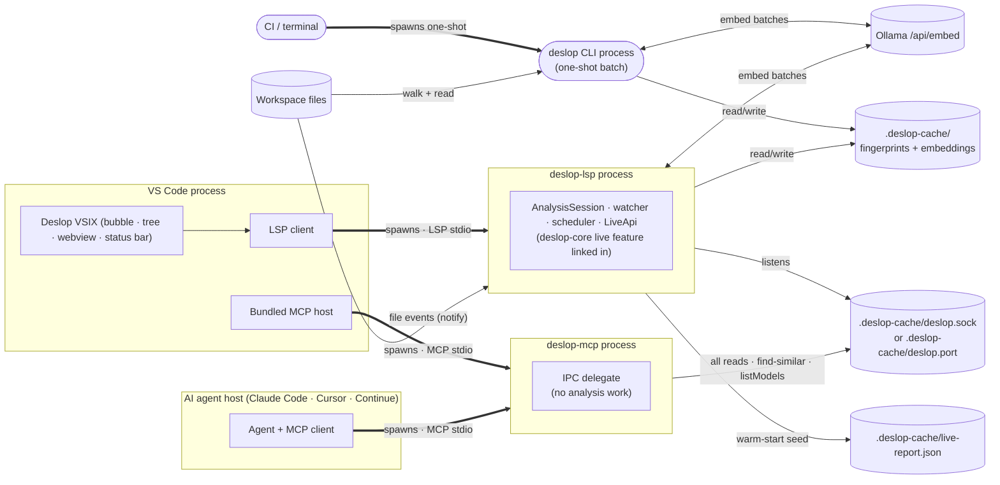

# Live analysis — in-process session in the LSP

`deslop-lsp` runs a persistent `AnalysisSession` that watches the workspace, re-analyses on every file change, and exposes the current in-memory report through a local IPC endpoint. `deslop-mcp` delegates to that endpoint — it runs no analysis of its own and does not read the warm-start state file. The CLI is unchanged: no watcher, no background threads, exits after one pass.

See also: [lsp.md](lsp.md), [mcp.md](mcp.md).

### [LIVE-PACKAGING] Crate + binary layout

The `live` module lives **inside `deslop-core`**, gated behind the `live` cargo feature. Only one binary links it:

- `crates/deslop-lsp` — JSON-RPC over stdio. Owns the `AnalysisSession`, the watcher, the scheduler, and all pipeline work. Writes the warm-start seed cache and exposes the IPC endpoint.

`crates/deslop-mcp` does **not** link the `live` feature. It is a pure transport adapter that delegates **every** read and compute call to the running LSP via the IPC socket ([LIVE-IPC-SOCKET]). It never reads `.deslop-cache/live-report.json` — that file is the LSP's private warm-start cache ([LIVE-SEED-CACHE]), not a wire contract.

`crates/deslop` (CLI) does not link `live` either — zero watcher, zero background threads.



### [LIVE-LIFECYCLE] Session lifecycle

One `AnalysisSession` per workspace root, owned by `deslop-lsp`. On `initialize`:

1. Opens `.deslop-cache/` for the root (fingerprint cache + embedding cache).
2. Runs a full initial analysis (warm cache on second launch → cheap).
3. Writes the initial report to `.deslop-cache/live-report.json` ([LIVE-SEED-CACHE]) so the next LSP startup can warm-start.
4. Starts the IPC socket ([LIVE-IPC-SOCKET]) — the read surface for the MCP.
5. Starts the file watcher ([LIVE-WATCHER]).
6. Starts the re-analysis scheduler ([LIVE-SCHEDULER]).
7. Sends `ready` with the initial `Report` to the LSP client.

Shutdown: stop accepting new edits, finish the current pass, flush caches, remove the IPC socket, exit. The session never writes outside `.deslop-cache/` and never modifies source files.

### [LIVE-PROFILING] CPU repro evidence

When `deslop-lsp` appears pegged at 100% CPU, capture both diagnosis channels:

1. Run the VS Code command `Deslop: Reveal CPU Report` and attach the markdown output.
2. Restart the extension host with `DESLOP_PROFILE_DIR=~/Desktop`, reproduce the spike, then zip and attach the generated `deslop-lsp-*-firefox-profile.json` file.

The profile path is compiled behind the `deslop-lsp` `profiling` cargo feature and is active only when `DESLOP_PROFILE_DIR` is set. The file is Firefox processed-profile JSON and can be opened at `https://profiler.firefox.com/` for stack inspection.

### [LIVE-EMBEDDING-CONSENT] Explicit live embedding consent

A fresh live session starts with structural + token/LSH signals only. The embedding pass is opt-in at the model boundary. The user selects a model from `embedding/listModels`; `embedding/setModel` is the consent boundary: the selected provider/model is recorded, the embedding cache is invalidated, and embedding work is queued immediately. Agent surfaces must not call this boundary autonomously or infer a preferred model.

Embedding refreshes are always low priority with bounded batches and yield states between them so the LSP transport, watcher, and editor remain responsive. `latest_report` serves the last complete structural/token report until the embedding-enhanced generation is ready.

Progress is observable: `queued`, `starting`, `running`, `complete`, `failed`.

A user-approved model switch from either live surface writes the shared workspace embedding settings (`.vscode/settings.json` keys `deslop.embedding.*`). The MCP must not hold a successful model change in process memory only — it writes the settings file so LSP picks it up on config reload.

### [LIVE-STATE] In-process state

```rust
pub struct AnalysisSession {
    pipeline: PipelineSession,
    latest_report: Arc<Report>,
    generation: u64,
    subscribers: Vec<Subscriber>,
    embedding_provider: Arc<dyn EmbeddingProvider>,
}
```

`PipelineSession` carries the file registry, per-file fingerprints, normalised trees, and source bytes ([PIPELINE-INCREMENTAL]). `AnalysisSession` adds orchestration state: the current snapshot, the generation counter, and the subscriber list. All mutable state is reachable from `AnalysisSession`. [STATE-FILE-REGISTRY] is still the only blessed process-global.

### [LIVE-SEED-CACHE] Warm-start seed cache

After the **initial** full pipeline pass and after every **cold-pass install** (the post-cache-seed background refresh), the LSP writes the current report to:

```
{workspace_root}/.deslop-cache/live-report.json
```

**Write is atomic:** write to `live-report.json.tmp`, then `rename()`. Readers always see a complete file or the previous version — never a partial write.

**Format:** canonical `Report` JSON — identical schema to `deslop --output report.json`.

**Use:** the file is an **LSP-private startup cache**, not an IPC channel. On the next LSP startup, [LIVE-CACHE-SEED] (`AnalysisSession::try_seeded_from_cache`) loads it so the editor sees clusters within milliseconds while the cold full pass runs in the background.

**Not written on:** per-keystroke incremental updates ([LIVE-SCHEDULER]) and embedding refresh commits — those used to spam the disk and contributed nothing to startup latency. The MCP no longer reads this file ([MCP-IPC-CLIENT]); it gets live state via the IPC socket. Stale-cache reads cannot leak hidden clusters because no one reads the cache except the LSP itself, post-restart, before its first cold pass overwrites it.

### [LIVE-IPC-SOCKET] IPC endpoint

The LSP exposes its in-memory `latest_report` directly through a local IPC endpoint. **This is the only read path used by the MCP.** No on-disk cache is consulted on the read side.

- **Unix/macOS:** `{workspace_root}/.deslop-cache/deslop.sock` (Unix domain socket) — the default transport.
- **Windows:** TCP loopback per [LIVE-IPC-TCP] — Windows has no Unix sockets, so `deslop-lsp` binds `127.0.0.1` and publishes the endpoint in a discovery record.

The LSP creates the endpoint on startup and removes its on-disk artifacts on clean shutdown. The MCP connects on demand (lazy, not persistent). Protocol: line-delimited JSON-RPC 2.0 on both transports.

### [LIVE-IPC-TCP] TCP loopback transport

Where Unix domain sockets do not exist (Windows) — or when `deslop-lsp` is started with `--ipc-transport tcp` on any platform — the IPC server binds an OS-assigned TCP port on `127.0.0.1` and publishes a **discovery record** at `{workspace_root}/.deslop-cache/deslop.port`. The record is the `IpcEndpointFile` wire model (typeDiagram, `docs/models/live-ipc.td`): `{ "port": <u16>, "token": "<64-hex>" }`.

- **Token gate.** The token is fresh per LSP session (128 bits of OS entropy, hex-encoded). A TCP client must present it as the **first line** of every connection, before any JSON-RPC; the server drops mismatching connections without a response. This keeps the analysis server closed to other local processes and turns a stale record colliding with a foreign listener into a clean failure instead of a garbage exchange. Unix-socket connections present no token — the filesystem already permission-guards the socket (the record itself is written `0600` where Unix permissions exist).
- **Same protocol.** Past the token line, both transports carry identical line-delimited JSON-RPC ([LIVE-IPC-SOCKET] method table applies verbatim).
- **Platform-neutral by construction.** The TCP path is plain `std::net` compiled on every platform, and the E2E suite (`crates/deslop-mcp/tests/tcp_transport.rs`) forces it on Unix CI — the code Windows runs in production is the code CI tests everywhere.
- The transport choice lives in `deslop_core::live::transport::IpcMode` (`platform_default()`: Unix socket where available, otherwise TCP).

### [MCP-IPC-DISCOVERY] Client endpoint discovery

The MCP resolves the endpoint per call: try the Unix socket where the platform has one; when it is absent or refuses, read the discovery record and dial loopback (presenting the token). When neither endpoint answers, every IPC call returns `LspNotRunning` naming **both** candidate paths so `--root` mismatches stay diagnosable ([Deslop#151]). A stale discovery record whose port no longer listens maps to the same `LspNotRunning`, never a hang.

**Single-shot methods** (one request → one response, connection closes):

| Method | MCP tool consumer |
|---|---|
| `report/get` | `report-get`, `report-query`, top-offenders bookkeeping |
| `report/forFile` | `report-for-file` |
| `report/forRange` | `report-for-range` |
| `cluster/byId` | `cluster-by-id` |
| `session/config` | `session-config` |
| `duplicates/findSimilar` | `find-similar` |
| `embedding/listModels` | `list-embedding-models` |
| `deslop.lsp.refreshReport` | `rescan` |

**Long-lived subscription**:

| Method | MCP behaviour |
|---|---|
| `report/subscribe` | One frame per generation bump until the subscriber disconnects. The MCP forwards each frame as `notifications/deslop/reportChanged` to its own client. |

If no endpoint is live ([MCP-IPC-DISCOVERY]), every IPC call returns `LspNotRunning` immediately. The MCP exposes that variant to its own client with an actionable message; it does **not** fall back to a second pipeline. CI / one-shot audits use the `deslop` CLI instead.

### [LIVE-WATCHER] File watcher

**The watcher runs only in `deslop-lsp`.** `deslop-mcp` watches only `.deslop-cache/live-report.json` (a single file) for change notifications — it never watches the workspace.

Use the `notify` crate (cross-platform, zero C deps). Watch the workspace root recursively, filtered by `LanguageParser::file_extensions()`. Debounce: **250 ms** of quiet after the last event, capped at **2 s** total accumulation so a formatter burst doesn't starve the scheduler.

Events matching `[EXCLUSION-CONFIG]` `exclude` patterns are dropped before debounce.

The LSP supplements the watcher with `textDocument/didChange` and `workspace/didChangeWatchedFiles` from the editor — belt-and-suspenders for in-buffer edits where the OS watcher may lag. Both paths converge on the same `AnalysisSession`.

### [LIVE-SCHEDULER] Re-analysis scheduler

After the watcher emits a coalesced changeset:

1. Calls `PipelineSession::update_files(changed: &[PathBuf]) -> Report`.
2. Pipeline reuses fingerprint and embedding caches.
3. Recomputes clustering + ranking over the updated fingerprint set.
4. Atomically swaps `latest_report`; bumps `generation`.
5. Broadcasts the new generation through `report_changed` so both LSP push notifications and IPC `report/subscribe` subscribers receive the same event ([LIVE-IPC-SOCKET]).
6. **Does NOT** rewrite `live-report.json`. The seed cache is per-cold-pass only ([LIVE-SEED-CACHE]).

Single-threaded per session. Consecutive queued changesets merge before dispatch.

Budget: ≤ 10 changed files, warm cache, 100 K-LOC → **< 500 ms**. Miss the budget → `tracing::warn!` with timing breakdown.

### [LIVE-DELTA] Report deltas

`ReportDelta` is the wire diff between two generations. LSP subscribers consume deltas instead of full snapshots so update traffic stays small.

```rust
pub struct ReportDelta {
    pub from_generation: u64,
    pub to_generation: u64,
    pub clusters_added: Vec<ReportCluster>,
    pub clusters_removed: Vec<String>,
    pub clusters_updated: Vec<ReportCluster>,
    pub cache_stats: CacheStats,
    pub tool_version: String,
}
```

Cluster ids are stable across runs ([REPORTING-CONTEXT §"How to read the report format"]). Clients that miss generations ask for a full snapshot via `report/get`, then resume delta consumption at the snapshot's generation.

### [LIVE-QUERY-API] Query API (LSP-internal)

The `live` module exposes the `LiveApi` trait. The LSP holds a `LiveApi` impl and routes both LSP-transport requests and IPC dispatches to it. The MCP does **not** hold `LiveApi`; every MCP read becomes one IPC round-trip to the LSP-held `LiveService` ([LIVE-IPC-SOCKET]). Single source of truth — no second copy of analysis state exists in the MCP process.

| Method | Input | Output | Purpose |
|---|---|---|---|
| `report/get` | `{}` | `Report` | Full current snapshot. |
| `report/delta` | `{ since_generation: u64 }` | `ReportDelta \| null` | Pull changes since a known generation. |
| `report/forFile` | `{ path }` | `FileReport` | Clusters touching this file. |
| `report/forRange` | `{ path, start_byte, end_byte }` | `Vec<ReportCluster>` | Clusters overlapping the byte range. |
| `cluster/byId` | `{ id }` | `ReportCluster` | Fetch by stable id. |
| `duplicates/findSimilar` | `{ path, start_byte, end_byte }` or `{ snippet, language }` | `Vec<ReportCluster>` | Parse + fingerprint + LSH + embedding against the live index. No cache mutation. |
| `embedding/listModels` | `{}` | `Vec<EmbeddingModelInfo>` | Enumerate available Ollama models. |
| `embedding/setModel` | `{ provider_id, model_id, endpoint? }` | `EmbeddingProvenance \| null` | Switch the live embedding model; write workspace settings. |
| `session/config` | `{}` | `SessionConfig` | min-nodes, languages, embedding provenance, exclusion config, cache dir. |

### [LIVE-NOTIFICATIONS] Push notifications

The LSP pushes three notification types to LSP clients (VSIX, other editors):

- `report/changed` — fires after every pass with a non-empty delta. Payload: `{ generation: u64, summary: ChangeSummary }`. Must fire for pure removals — suppressing it is a bug.
- `analysis/state` — fires on `idle → running`, `running → idle`, and on scheduler errors.
- `embedding/progress` — fires around embedding refreshes. Payload: `{ phase, provider_id, model_id, done, total, message? }`.

The MCP **is** an IPC subscriber. It opens one long-lived `report/subscribe` connection over the socket and re-emits each `report/changed` notification to its own client as `notifications/deslop/reportChanged` ([MCP-NOTIFICATIONS]). It never reads `.deslop-cache/live-report.json` and never watches the workspace.

### [LIVE-PERF-BUDGETS] Performance budgets

| Scenario | Budget |
|---|---|
| Cold start, empty cache, 100 K LOC | Same as `--incremental` CLI first-run. |
| Warm start, warm cache, 100 K LOC | < 2 s to `ready`. |
| Incremental re-analysis, ≤ 10 changed files | < 500 ms end-to-end. |
| `report/forFile`, 100 K-LOC report | < 50 ms. |
| `duplicates/findSimilar`, ≤ 200-node snippet | < 250 ms. |

Missed budgets → `tracing::warn!` with timing breakdown. Ratchet only.

### [LIVE-NO-REGEX-NO-SHORTCUTS] Rules inherited

No regex on source, no `unwrap`, no panics, `thiserror` for library errors, structured `tracing` only, 500-line file budget, coarse E2E tests only. E2E tests drive the real LSP binary over stdio with a fixture workspace and assert against rendered deltas — never reach into `AnalysisSession` internals.
