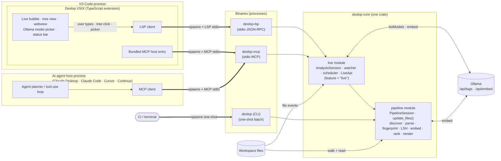

# Live analysis — in-memory session behind the LSP and MCP servers

Deslop v1 is a batch CLI. The VSIX, the LSP server, and the MCP server all need a **live, watcher-driven, always-up-to-date report** that updates as the user (or an AI agent) edits files. This document specifies the `live` module inside `deslop-core` that every non-CLI binary runs on top of. The CLI pipeline is unchanged — the `live` module is a thin orchestration layer over [PIPELINE-INCREMENTAL] and the `update_files(changed)` entry point promised in [pipeline.md §13](pipeline.md).

**There is no daemon process.** The `live` module just keeps an analysis session alive for as long as the binary that owns it is running. The LSP server and the MCP server are long-running because LSP and MCP are long-running protocols; they're not background services, they're conventional editor-spawned stdio servers (same lifecycle as `rust-analyzer`).

See also: [lsp.md](lsp.md), [mcp.md](mcp.md), [vsix.md](vsix.md).

### [LIVE-PACKAGING] Crate + binary layout

The `live` module lives **inside `deslop-core`**, gated behind the `live` cargo feature. Two thin binaries link it:

- `crates/deslop-lsp` — JSON-RPC over stdio (LSP transport).
- `crates/deslop-mcp` — JSON-RPC over stdio (Model Context Protocol transport).

Both binaries stay under 100 LOC of glue — transport demux, dispatch, shutdown. All live-session logic — state, watcher, scheduler, query API — is reachable from `deslop_core::live::*` once the feature is enabled. Nothing in the pipeline moves; no pipeline code is duplicated.

End-to-end flow — who owns each box, who talks to whom, and where the live analysis lives:



**The CLI does not enable the `live` feature.** CLI builds stay zero-watcher, zero-background-thread, zero `notify` dependency — identical to v1. The feature flag — not a separate crate — is what keeps the CLI lean. One crate, one lint profile, one version, one place to add a language. See [principles.md §[PRINCIPLES-LONG-RUNNING-DAEMON]](principles.md).

Two consumers of the live analysis live inside the VS Code process (the VSIX UI through the LSP client, and any MCP-aware agent inside VS Code through the bundled MCP host), and one lives outside (an AI agent running in a terminal that spawns `deslop-mcp` directly). All three paths — VSIX UI, in-editor agent, external agent — end at the same `AnalysisSession` in the `live` module and the same `PipelineSession` underneath. Nothing is re-implemented per client.

### [LIVE-LIFECYCLE] Session lifecycle

One `AnalysisSession` per workspace root, owned by the binary that created it. The client (VSIX / LSP client / MCP client) launches a binary, the binary receives an `initialize` frame with the workspace root + config (min-nodes, exclusion config path, embedding settings), and the session:

1. Opens the `.deslop-cache/` for that root (fingerprint cache + embedding cache).
2. Runs a full initial deterministic analysis with incremental semantics on — usually a warm cache on second launch, so startup is cheap. The live session does **not** run embeddings here unless the client supplied a previously-selected model.
3. Starts a file watcher ([LIVE-WATCHER]).
4. Starts the re-analysis scheduler ([LIVE-SCHEDULER]).
5. Sends `ready` with the initial `Report`.

Shutdown is a graceful drain: stop accepting new edits, finish the current re-analysis, flush caches, exit. The session never writes outside `.deslop-cache/` and never modifies source files.

### [LIVE-EMBEDDING-CONSENT] Explicit live embedding consent

LSP and MCP are live modes, so local embedding work is opt-in at the model boundary. A fresh live session starts with structural + token/LSH signals only. It must not begin the embedding pass merely because Ollama is installed, because a local model pass can take minutes and can compete with the editor or agent loop for CPU.

Before the first live embedding pass, the client tells the user that local embedding calculations are about to run and that they may be slow. The user then selects a concrete model from `embedding/listModels`. `embedding/setModel` is the consent boundary: after that call the selected provider/model is recorded as active, the embedding cache layer is invalidated, and embedding work is queued immediately. Agent-facing surfaces must not call this boundary autonomously, infer a preferred model, or "upgrade" the model as a convenience; MCP requires an explicit `user_initiated: true` argument and may only set it after a human asked for the switch.

Selected-model embedding refreshes are always low priority. Provider calls run in bounded batches, and live mode inserts short yield/sleep states between batches so the LSP, MCP transport, file watcher, and editor remain responsive. While embedding work is queued or running, `latest_report` remains the last complete structural/token report; live consumers keep serving it until the embedding-enhanced generation is ready.

Embedding state is observable through progress notifications with `queued`, `starting`, `running`, `complete`, and `failed` phases. Clients surface those states in a stable place, preferably the VSIX Session panel, with model id, done/total counts where known, and failure text when a provider rejects the pass.

LSP and MCP model state must not diverge. A user-approved model switch from either live surface writes the same workspace embedding settings (`deslop.embedding.provider`, `deslop.embedding.model`, `deslop.embedding.endpoint`, and `deslop.embedding.mode`) that the VSIX/LSP reads on startup and configuration reload. MCP must not keep a successful model change only in process memory; if it accepts a user-initiated switch, the shared settings file is the source of truth that keeps LSP, VSIX, and MCP reactive to one another.

### [LIVE-STATE] In-process state

The `live` module keeps one `AnalysisSession` in memory:

```rust
pub struct AnalysisSession {
    pipeline: PipelineSession,        // analysis state (deslop-core::pipeline)
    latest_report: Arc<Report>,       // immutable snapshot, swapped atomically
    generation: u64,                  // monotonic; bumped every re-analysis
    subscribers: Vec<Subscriber>,     // LSP/MCP clients awaiting deltas
    embedding_provider: Arc<dyn EmbeddingProvider>,
}
```

`PipelineSession` already carries the file registry, the per-file fingerprints, the normalised trees, and the source bytes ([PIPELINE-INCREMENTAL] + [DECISION-MIN-NODES]). `AnalysisSession` adds only **orchestration state**: the current report snapshot, the generation counter, and the subscriber list.

`latest_report` is an `Arc<Report>` swapped under a lock so readers get a consistent snapshot. `generation` lets a subscriber skip forward: *"I last saw generation 42, what changed since?"* This is the same version-cursor pattern an LSP uses for document syncs.

All mutable state is reachable from `AnalysisSession`. Nothing in `deslop-core` adds new process-global mutable state — [STATE-FILE-REGISTRY] is still the only blessed global, and it's owned per-session through `PipelineSession`.

### [LIVE-WATCHER] File watcher

Use the `notify` crate (cross-platform, already on the v2 roadmap per [PRINCIPLES-LONG-RUNNING-DAEMON]). Watch the workspace root recursively, filtered by the same extension set registered via the `LanguageParser` trait.

Events are debounced and coalesced: a burst of saves from a formatter or refactor tool must collapse into one re-analysis pass. Debounce window is **250 ms** of quiet after the last event, capped at **2 s** of total accumulation so a stream of edits doesn't starve the scheduler.

Events that cross `[EXCLUSION-CONFIG]` `exclude` patterns are dropped before debounce — the session never re-parses an excluded file.

### [LIVE-SCHEDULER] Re-analysis scheduler

After the watcher emits a coalesced changeset, the scheduler:

1. Calls `PipelineSession::update_files(changed: &[PathBuf]) -> Report` ([pipeline.md §13]).
2. The pipeline reuses the P6 fingerprint cache and the P5 embedding cache transparently.
3. Recomputes clustering + ranking over the updated fingerprint set.
4. Atomically swaps `latest_report`; bumps `generation`.
5. Pushes a `ReportDelta` to every subscriber.

Re-analysis is single-threaded per session — one pass in flight at a time. If a new changeset lands while one is running, it's queued; consecutive queued changesets are merged before dispatch. This keeps the session CPU-bounded by the incremental cost of what actually changed, never by redundant re-runs.

Budget: a coalesced changeset of ≤ 10 files with a warm fingerprint cache must complete re-analysis in **< 500 ms** on a 100 K-LOC workspace. Miss the budget → `tracing::warn!` with the timing breakdown; the budget is a perf regression guard, not a correctness assertion.

### [LIVE-DELTA] Report deltas

`ReportDelta` is the wire-shaped diff between two generations of `Report`. Subscribers consume deltas instead of full snapshots so update traffic stays small when one file changes in a repo with thousands of clusters.

```rust
pub struct ReportDelta {
    pub from_generation: u64,
    pub to_generation: u64,
    pub clusters_added: Vec<ReportCluster>,
    pub clusters_removed: Vec<String>,       // cluster ids
    pub clusters_updated: Vec<ReportCluster>,
    pub cache_stats: CacheStats,
    pub tool_version: String,
}
```

`ReportDelta` lives in `deslop_core::delta` (no feature gate — it's a pure projection over two reports, useful to any consumer). Cluster ids are stable across runs ([REPORTING-CONTEXT §"How to read the report format"]) — same clone, same id, even after an edit. That stability is what makes the delta shape useful: an IDE can keep its tree view mounted and just flip colours when a cluster's signals or occurrence set changes.

Clients that miss too many generations (or connect mid-session) ask for a full snapshot via `report/get`, then resume delta consumption at the snapshot's generation.

### [LIVE-QUERY-API] Query API (shared by LSP + MCP)

The `live` module exposes a small, stable query surface through the `LiveApi` trait. Both the LSP and the MCP servers hold a `LiveApi` impl and forward transport-framed requests to it. This is the contract the VSIX UI and the AI agent both speak.

| Method | Input | Output | Purpose |
|---|---|---|---|
| `report/get` | `{}` | `Report` | Full current snapshot. |
| `report/delta` | `{ since_generation: u64 }` | `ReportDelta` or `null` | Pull changes since a known generation. |
| `report/forFile` | `{ path: String }` | `FileReport` | All clusters whose occurrences touch this file, byte-range sorted. |
| `report/forRange` | `{ path, start_byte, end_byte }` | `Vec<ReportCluster>` | Clusters overlapping the given byte range. Powers "is the code I'm editing a duplicate of something?" |
| `cluster/byId` | `{ id: ClusterId }` | `ReportCluster` | Fetch a cluster by stable id (for "jump to other occurrences"). |
| `duplicates/findSimilar` | `{ path, start_byte, end_byte }` or `{ snippet, language }` | `Vec<ReportCluster>` | Agent-facing: "is this snippet I'm about to write already present elsewhere?" Runs the fingerprint + LSH + embedding passes on the snippet against the live index; no cache mutation. |
| `embedding/listModels` | `{}` | `Vec<EmbeddingModelInfo>` | Enumerates Ollama models available on the host (`/api/tags`) plus the built-in `stub` provider. Powers the VSIX model picker. |
| `embedding/setModel` | `{ provider_id, model_id, endpoint? }` | `EmbeddingProvenance \| null` | User-selected consent boundary. Switches the live session to the selected model, invalidates only the embedding layer ([FUSION-EMBED-PROVIDER]), then queues low-priority embedding work. `null` means the refresh was accepted and the new provenance will appear on the next completed report. Structural + LSH caches stay warm. |
| `session/config` | `{}` | `SessionConfig` | min-nodes, languages active, embedding provenance, exclusion config path, `.deslop-cache/` path. |

All methods are synchronous request/response. **No subscribe/unsubscribe primitives** on the query API — deltas are pushed (see [LIVE-NOTIFICATIONS]). Keeping read and push separate makes the transport layering identical for LSP and MCP.

### [LIVE-NOTIFICATIONS] Push notifications

The session pushes three notification types:

- `report/changed` — fires after every scheduler pass that produced a non-empty delta (cluster added / removed / updated, or signal change on any existing cluster). Payload: `{ generation: u64, summary: ChangeSummary }` where `ChangeSummary` is `{ clusters_added: usize, clusters_removed: usize, clusters_updated: usize, worst_weight: f64 }`. Subscribers that want the full delta call `report/delta`. The session must fire this notification for **every** observable change, including pure removals (a deduplication edit that drops the cluster count from N to N-1 still fires `clusters_removed >= 1` and the VSIX must redraw — see [VSIX-REACTIVITY-INVARIANT]). Suppressing the notification because the *worst* cluster is unchanged is a bug.
- `analysis/state` — fires on `idle → running`, `running → idle`, and on scheduler errors. Lets the VSIX render a live status indicator without polling.
- `embedding/progress` — fires around live embedding refreshes. Payload: `{ phase, provider_id, model_id, done, total, message? }`. Phases are `queued`, `starting`, `running`, `complete`, and `failed`.

Notifications are fire-and-forget on the wire; subscribers that fall behind never block the scheduler. **The contract on the receiver side is non-negotiable: every editor client must apply the delta to its in-process store and re-render every surface that depends on the changed clusters.** For the VSIX that store + re-render path is mandated by [VSIX-REACTIVITY] (one signal graph, every surface). A client that receives `report/changed` and leaves any UI surface showing the pre-notification state is broken.

### [LIVE-PERF-BUDGETS] Performance budgets

| Scenario | Budget |
|---|---|
| Cold start, empty cache, 100 K LOC | Same as `--incremental` CLI first-run (no new budget). |
| Warm start, warm cache, 100 K LOC | < 2 s to `ready`. |
| Incremental re-analysis of ≤ 10 changed files | < 500 ms end-to-end. |
| `report/forFile` on a 100 K-LOC report | < 50 ms (index lookup, not re-analysis). |
| `duplicates/findSimilar` on a ≤ 200-node snippet | < 250 ms (one parse + one LSH/ANN probe). |

All budgets are measured per [PERF-BUDGET-TYPE12] methodology: release build, not instrumented, warmed-up JIT equivalent (= second invocation). Missed budgets surface as `tracing::warn!` with a timing breakdown; budget regressions are tracked the same way coverage is — ratchet only, never regress.

### [LIVE-NO-REGEX-NO-SHORTCUTS] Rules inherited

Everything from CLAUDE.md still applies inside the `live` module: no regex on source, no `unwrap`, no panics, `thiserror` for library errors, structured `tracing` only, 500-line file budget, coarse E2E tests only. E2E for the live module drives the real LSP/MCP binary over stdio with a fixture workspace and asserts against rendered deltas — never reaches into `AnalysisSession` internals.
